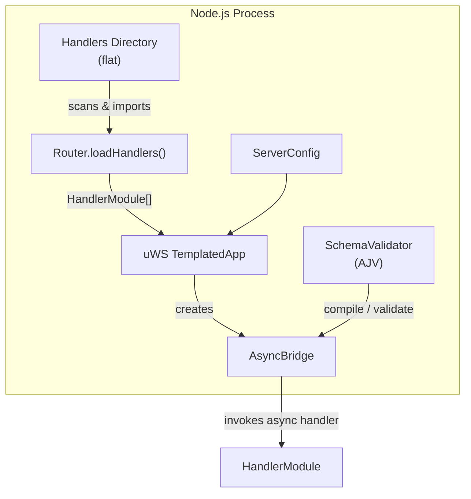
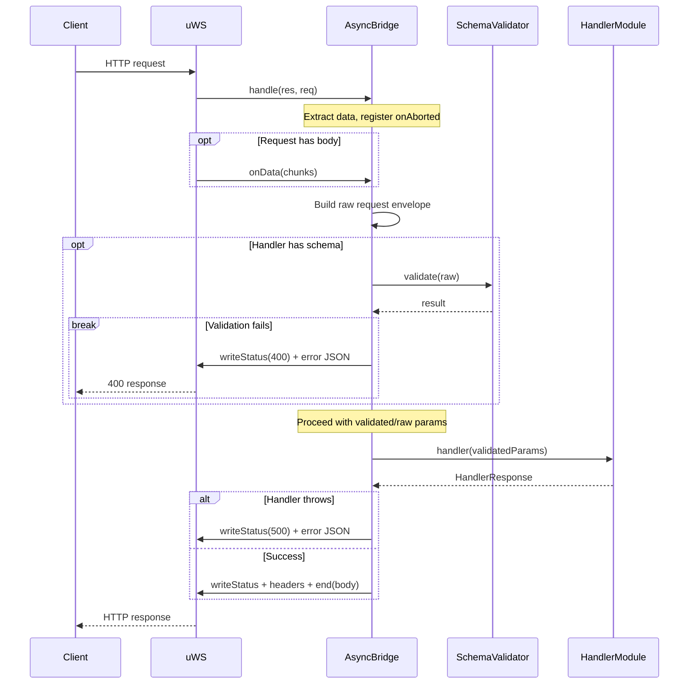

# TECHNICAL SPECIFICATION: uws-api-server

## A Thin, Async‑Friendly Wrapper Around uWebSockets.js

**Technical Specification — Version 1.0**

---

## 1. Overview

`uws-api-server` provides a minimal, opinionated wrapper around **uWebSockets.js** (the C++/Node.js HTTP server). It bridges uWS’s native callback‑based API into regular `async`/`await` handlers, enforces **JSON Schema validation** as an allow‑list for every request, and ships with ready‑to‑use **PM2** and **systemd** configuration files for production deployment. The module is designed to be **duplicated across projects** rather than shared as a dependency – it is self‑contained, AI‑regeneratable, and its behaviour is verified by a fixed testing contract.

**Key features:**

- Flat directory of handler files; each file exports an HTTP method, path, optional JSON Schema, and an async handler.
- Automatic body collection, query‑string parsing, and route‑parameter extraction – all done before the handler is called.
- Every request is validated against its JSON Schema (body, query, params, headers); unknown properties are rejected by default (`additionalProperties: false`), providing an effective allow‑list.
- Internally converts uWS stack‑allocated request/response objects into a safe, promise‑based flow.
- Includes a default PM2 ecosystem file and a systemd unit file, with documented placeholders, so the module can be deployed with zero additional config.
- Depends only on `uWebSockets.js` and `ajv`; all other logic is contained in the wrapper.
- Focused exclusively on HTTP REST; WebSocket support is out of scope.

---

## 2. Component Specifications

### 2.1 Data Structures

```typescript
/**
 * Supported HTTP methods.
 */
type HttpMethod = 'GET' | 'POST' | 'PUT' | 'PATCH' | 'DELETE';

/**
 * JSON Schema as defined by the JSON Schema specification (Draft‑07 or later).
 * The library uses AJV for validation.
 */
interface JSONSchema {
  [key: string]: unknown;
}

/**
 * Normalised request data passed to the handler after validation.
 */
interface ValidatedRequestParams {
  body: unknown; // parsed JSON body, or undefined if no schema for body
  query: Record<string, string>; // parsed query string
  params: Record<string, string>; // route parameters (e.g., /users/:id)
  headers: Record<string, string>; // request headers, lowercased
}

/**
 * Return value of a handler.
 */
interface HandlerResponse {
  statusCode?: number; // default 200
  headers?: Record<string, string>; // extra headers (Content‑Type is set automatically)
  body?: unknown; // if present, JSON‑serialised; if undefined, a 204 No Content is sent
}

/**
 * A single handler module exported from a file in the flat directory.
 */
interface HandlerModule {
  /**
   * Route definition, formatted as "METHOD path".
   * Examples: "GET /health", "POST /users", "PATCH /users/:id".
   */
  route: string;

  /**
   * Optional JSON Schema for the request envelope.
   * Must be an object with optional properties: body, query, params, headers.
   * Each property is its own schema. If a property is missing, it is passed through as‑is.
   * All schemas are compiled with `additionalProperties: false` to enforce allow‑listing.
   */
  schema?: JSONSchema;

  /**
   * Async handler that receives validated request data.
   */
  handler: (params: ValidatedRequestParams) => Promise<HandlerResponse>;
}
```

### 2.2 Core Classes & Interfaces

#### 2.2.1 `Router`

```typescript
/**
 * Scans a flat directory of handler files and returns an array of validated HandlerModule objects.
 *
 * Each file must have a default export that satisfies the HandlerModule interface.
 * The `route` string is parsed and checked; the directory does **not** encode the route.
 */
class Router {
  /**
   * @param handlersDir - Absolute path to the directory containing handler modules.
   * @throws If any module fails to load or has an invalid route definition.
   */
  static async loadHandlers(handlersDir: string): Promise<HandlerModule[]> {
    // 1. Read all .ts / .js files (using dynamic imports).
    // 2. Validate each module’s shape (route, handler, optional schema).
    // 3. Return list.
  }
}
```

#### 2.2.2 `SchemaValidator`

```typescript
/**
 * Wraps AJV to compile and validate request schemas.
 */
class SchemaValidator {
  private ajv: Ajv;

  constructor() {
    this.ajv = new Ajv({
      allErrors: true,
      removeAdditional: 'all',
      coerceTypes: false,
    });
    // Custom formats can be added here.
  }

  /**
   * Compile a request‑envelope schema into a validation function.
   * @param schema - A JSON Schema for the whole request (body, query, params, headers).
   * @returns A function that validates a raw request object.
   */
  compile(schema: JSONSchema): (data: unknown) => boolean {
    return this.ajv.compile(schema);
  }

  /**
   * Validate a request envelope and return a cleaned, allow‑listed object.
   * Throws a ValidationError on failure.
   */
  validate(
    raw: {
      body?: unknown;
      query?: unknown;
      params?: unknown;
      headers?: unknown;
    },
    validateFn: (data: unknown) => boolean,
  ): ValidatedRequestParams {
    // apply validation; on error, collect errors and throw.
  }
}
```

#### 2.2.3 `AsyncBridge`

```typescript
/**
 * Converts a uWS HTTP route callback into an async/await handler.
 *
 * Usage (inside uWS route registration):
 *   const bridge = new AsyncBridge(schemaValidator, handler);
 *   app.get('/path', (res, req) => bridge.handle(res, req));
 */
class AsyncBridge {
  private validate?: (data: unknown) => boolean;
  private handler: (params: ValidatedRequestParams) => Promise<HandlerResponse>;

  /**
   * @param schemaValidator - Instance of SchemaValidator.
   * @param handlerModule - The compiled handler module with optional schema.
   * @param routeParams - Names of the route parameters in order (from the route pattern).
   */
  constructor(
    private readonly schemaValidator: SchemaValidator,
    handlerModule: HandlerModule,
    private readonly routeParams: string[], // e.g., ['id'] for "/users/:id"
  ) {
    if (handlerModule.schema) {
      this.validate = schemaValidator.compile(handlerModule.schema);
    }
    this.handler = handlerModule.handler;
  }

  /**
   * The entry point called by uWS.
   * It must immediately capture all necessary data from the stack‑allocated `res` and `req`.
   */
  handle(res: uWS.HttpResponse, req: uWS.HttpRequest): void {
    // 1. Immediately extract URL, query, method, headers, and route parameters.
    // 2. Register onAborted callback.
    // 3. Set up data reception (res.onData) to collect body.
    // 4. Once the body is fully received (or immediately for GET/HEAD), call processRequest.
  }

  private async processRequest(
    raw: {
      body?: unknown;
      query: Record<string, string>;
      params: Record<string, string>;
      headers: Record<string, string>;
    },
    res: uWS.HttpResponse,
  ): Promise<void> {
    // 1. If validate function exists, run it; on error, send 400 response with details.
    // 2. Call this.handler with clean parameters.
    // 3. On success, write the response (status code, headers, body).
    // 4. On failure, send 500 with error message.
  }
}
```

#### 2.2.4 `Server`

```typescript
/**
 * Creates, configures, and starts a uWS HTTP server with the loaded handler modules.
 */
class Server {
  private app: uWS.TemplatedApp;

  /**
   * @param config - Server configuration (port, host, etc.).
   * @param handlers - List of HandlerModule objects from the Router.
   */
  constructor(
    private readonly config: ServerConfig,
    private readonly handlers: HandlerModule[],
  ) {
    this.app = uWS.App();
    this.registerRoutes();
  }

  /**
   * Mount every handler on its declared route.
   */
  private registerRoutes(): void {
    const schemaValidator = new SchemaValidator();

    for (const handler of this.handlers) {
      const { method, path, paramNames } = this.parseRoute(handler.route);

      const bridge = new AsyncBridge(schemaValidator, handler, paramNames);

      // Example for GET:
      if (method === 'GET') {
        this.app.get(path, (res, req) => bridge.handle(res, req));
      }
      // … similar for POST, PUT, PATCH, DELETE
    }
  }

  /**
   * Start listening.
   */
  async listen(): Promise<void> {
    this.app.listen(this.config.host, this.config.port, (token) => {
      if (token) {
        console.log(
          `Listening on http://${this.config.host}:${this.config.port}`,
        );
      } else {
        throw new Error(`Failed to listen on port ${this.config.port}`);
      }
    });
  }
}

interface ServerConfig {
  port: number;
  host: string; // typically '0.0.0.0'
  handlersDir: string; // directory to scan for handler modules
}
```

#### 2.2.5 Route Parser (utility)

```typescript
/**
 * Parses a route string "METHOD /path/with/:params" into method, uWS pattern, and parameter names.
 */
function parseRoute(route: string): {
  method: HttpMethod;
  path: string;
  paramNames: string[];
} {
  // Split on first space; validate method and path; extract :param tokens.
}
```

---

## 3. System Architecture



The system is entirely contained within a single Node.js process. There are no external data stores; all state resides in memory.

---

## 4. Detailed Data Flow

Below is the sequence for a single HTTP request:



---

## 5. Production Configuration Files

The module ships with two ready‑to‑use templates. Both contain placeholders documented in comments; replace them with actual values.

### 5.1 PM2 Ecosystem File (`pm2.ecosystem.config.cjs`)

```javascript
module.exports = {
  apps: [
    {
      name: 'uws-api-server',
      script: './dist/cli.js', // or the compiled CLI entry point
      args: ['--port', '3000', '--handlers-dir', './handlers'],
      instances: 'max', // cluster mode
      exec_mode: 'cluster',
      watch: false,
      max_memory_restart: '500M',
      env: {
        NODE_ENV: 'production',
      },
      log_date_format: 'YYYY-MM-DD HH:mm:ss Z',
      error_file: './logs/err.log',
      out_file: './logs/out.log',
      merge_logs: true,
      log_type: 'json',
      // PM2 log rotation is handled by pm2-logrotate (install separately).
      // Alternative: redirect stdout/stderr to a file and let an external rotator handle it.
    },
  ],
};
```

### 5.2 systemd Unit File (`api-server.service`)

```ini
[Unit]
Description=uWS API Server
After=network.target

[Service]
Type=simple
User=nobody
WorkingDirectory=/opt/uws-api-server
ExecStart=/usr/bin/node /opt/uws-api-server/dist/cli.js --port 3000 --handlers-dir ./handlers

Restart=always
RestartSec=10
StandardOutput=journal+console
StandardError=journal+console
SyslogIdentifier=uws-api-server
Environment=NODE_ENV=production

# Security hardening
NoNewPrivileges=true
PrivateTmp=true
ProtectSystem=strict
ProtectHome=true
ReadWritePaths=/opt/uws-api-server/logs

[Install]
WantedBy=multi-user.target
```

---

## 6. Testing Requirements

### 6.1 Unit Tests

| Class / Module        | Test Case                                     | Scenario                                                                                                                 | Verification                                                                          |
| --------------------- | --------------------------------------------- | ------------------------------------------------------------------------------------------------------------------------ | ------------------------------------------------------------------------------------- |
| `Router.loadHandlers` | Loads a directory of valid handler modules    | Directory contains two files, each exporting a valid `HandlerModule`                                                     | Returns an array with exactly those two modules; `route` parsed correctly             |
| `Router.loadHandlers` | Rejects a module with an invalid route string | File exports `{ route: "INVALID /path" }`                                                                                | Throws an error during loading                                                        |
| `Router.loadHandlers` | Rejects a module missing the handler property | File exports `{ route: "GET /test" }` (no handler)                                                                       | Throws                                                                                |
| `SchemaValidator`     | Validates a correct request envelope          | Provide a valid body/query/params/headers matching schema                                                                | Returns cleaned object with only allowed properties                                   |
| `SchemaValidator`     | Rejects unknown properties (allow‑list)       | Schema defines `body: { properties: { name: string }, additionalProperties: false }`; send `{ name: "ok", extra: true }` | Validation fails; error lists "extra" as not allowed                                  |
| `SchemaValidator`     | Handles missing optional segments             | Schema defines only `body`; no `query` schema is given                                                                   | Query string is passed through unchanged (no validation)                              |
| `AsyncBridge`         | Successful async handler                      | Bridge receives a request, validates, calls handler, handler returns `{ statusCode: 201, body: { id: 1 } }`              | Response `201 Created` with JSON body `{"id":1}`                                      |
| `AsyncBridge`         | Handler throws an error                       | Bridge calls handler that throws `new Error("db down")`                                                                  | Response `500 Internal Server Error` with JSON `{ error: "db down" }`                 |
| `AsyncBridge`         | Validation error                              | Schema requires `body.name`; send empty body                                                                             | Response `400 Bad Request` with JSON `{ error: "Validation failed", details: [...] }` |
| `AsyncBridge`         | Aborted request                               | uWS calls `onAborted` before processing completes                                                                        | Handler promise is not resolved, no response sent                                     |
| `parseRoute`          | Parses valid route with parameters            | `"PATCH /users/:userId"`                                                                                                 | Returns `{ method: 'PATCH', path: '/users/:userId', paramNames: ['userId'] }`         |
| `parseRoute`          | Rejects invalid method                        | `"CHEESE /users"`                                                                                                        | Throws                                                                                |

### 6.2 Integration Tests

**Environment Setup:**  
Start the `Server` with a temporary directory containing a few real handler modules. The tests issue HTTP requests (via `fetch` or `http.request`) against `localhost` on a dynamic port.

**Test Cases:**

1. **GET /health** – a simple handler returns `{ status: "ok" }` with 200.
2. **POST /users** – handler validates body against schema; returns 201 with the created object.  
   – Also send an invalid body (missing required field) → 400.
3. **Patch /users/:id** – use a route parameter; handler verifies the `id` appears in `params`.
4. **Query string handling** – ``GET /search?q=test` – handler receives parsed query.
5. **Allow‑list enforcement** – handler schema for body has `additionalProperties: false`; send extra field → 400.
6. **Async error** – handler `throw new Error("fail")` → 500 with error message.
7. **Large body** – handler accepts a body up to a configured limit (if any), else large payloads should not crash.
8. **Server startup with invalid handler** – Verify that if a handler module fails to load (e.g., syntax error), the server does not start and the error is logged.
9. **Header validation** – handler declares a required header (e.g., `X-API-Key`) in its schema; missing header → 400.

**Post‑test Validation:**

- All responses have the correct `Content-Type: application/json` unless handler overrides.
- The PM2/systemd configuration files are syntactically valid (can be checked with `pm2 start ecosystem.config.cjs --only uws-api-server` and `systemd-analyze verify`).

---

## 7. CLI Entry Point

```typescript
/**
 * CLI argument shape.
 */
interface CliArgs {
  port: number; // HTTP port (default 3000)
  host: string; // bind address (default '0.0.0.0')
  'handlers-dir': string; // path to the flat directory (default './handlers')
}

/**
 * Main function.
 */
async function main(args: CliArgs): Promise<void> {
  // 1. Load handler modules from args['handlers-dir'].
  // 2. Create a Server instance with the loaded handlers and config.
  // 3. Start listening.
  // 4. Log ready message.
}

// Run if called directly.
if (require.main === module) {
  const argv = parseArgs(process.argv.slice(2));
  main(argv).catch((err) => {
    console.error('Server failed to start:', err);
    process.exit(1);
  });
}
```

**Example invocation:**

```bash
node dist/cli.js --port 8080 --handlers-dir ./api-handlers
```

---

**End of Specification**
