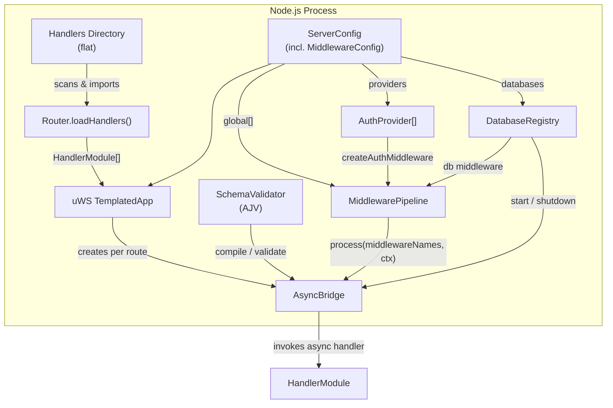
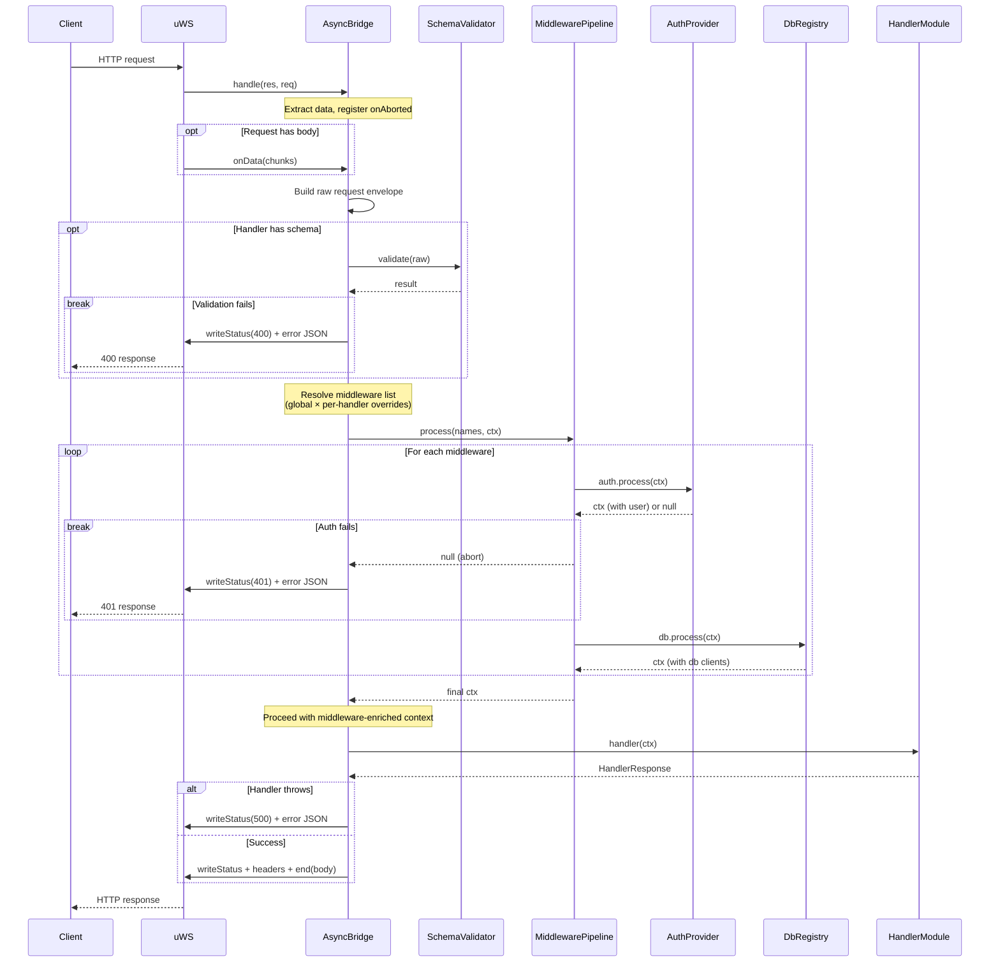

# TECHNICAL SPECIFICATION: uws-api-server

## A Thin, Async‑Friendly Wrapper Around uWebSockets.js

**Technical Specification — Version 2.0**

---

## 1. Overview

`uws-api-server` provides a minimal, opinionated wrapper around **uWebSockets.js** (the C++/Node.js HTTP server). It bridges uWS’s native callback‑based API into regular `async`/`await` handlers, enforces **JSON Schema validation** as an allow‑list for every request, and ships with ready‑to‑use **PM2** and **systemd** configuration files for production deployment. The module is designed to be **duplicated across projects** rather than shared as a dependency – it is self‑contained, AI‑regeneratable, and its behaviour is verified by a fixed testing contract.

**Version 2.0** adds a **middleware layer** supporting modular authentication and persistent database connections. Middleware can be registered globally (applied to every route) and overridden per handler. Auth providers and database connectors are pluggable via interfaces — the core ships only the contract; users provide implementations.

**Key features:**

- Flat directory of handler files; each file exports an HTTP method, path, optional JSON Schema, and an async handler.
- Automatic body collection, query‑string parsing, and route‑parameter extraction – all done before the handler is called.
- Every request is validated against its JSON Schema (body, query, params, headers); unknown properties are rejected by default (`additionalProperties: false`), providing an effective allow‑list.
- Internally converts uWS stack‑allocated request/response objects into a safe, promise‑based flow.
- **Middleware pipeline** runs after schema validation and before the handler: auth providers set `ctx.user`, database connectors inject `ctx.db`, and custom middleware can extend the context or abort the request.
- Middleware binding is layered: **global defaults** + **per-handler overrides** (skip global, add extra, or replace entirely).
- Includes a default PM2 ecosystem file and a systemd unit file, with documented placeholders, so the module can be deployed with zero additional config.
- Depends only on `uWebSockets.js` and `ajv`; all other logic is contained in the wrapper.
- Focused exclusively on HTTP REST; WebSocket support is out of scope.

---

## 2. Component Specifications

### 2.1 Data Structures

```typescript
/**
 * Supported HTTP methods.
 */
type HttpMethod = 'GET' | 'POST' | 'PUT' | 'PATCH' | 'DELETE';

/**
 * JSON Schema as defined by the JSON Schema specification (Draft‑07 or later).
 * The library uses AJV for validation.
 */
interface JSONSchema {
  [key: string]: unknown;
}

/**
 * Normalised request data passed to the handler after validation.
 */
interface ValidatedRequestParams {
  body: unknown; // parsed JSON body, or undefined if no schema for body
  query: Record<string, string>; // parsed query string
  params: Record<string, string>; // route parameters (e.g., /users/:id)
  headers: Record<string, string>; // request headers, lowercased
}

/**
 * Return value of a handler.
 */
interface HandlerResponse {
  statusCode?: number; // default 200
  headers?: Record<string, string>; // extra headers (Content‑Type is set automatically)
  body?: unknown; // if present, JSON‑serialised; if undefined, a 204 No Content is sent
}

/**
 * Authenticated user attached to the context by an auth middleware.
 */
interface AuthUser {
  id: string;
  roles: string[];
  [key: string]: unknown;
}

/**
 * Context object passed to middleware and the final handler.
 * Extends ValidatedRequestParams with authentication and database properties.
 */
interface MiddlewareContext extends ValidatedRequestParams {
  user?: AuthUser;
  db?: Record<string, unknown>;
}

/**
 * Result returned by an AuthProvider.
 */
interface AuthResult {
  success: boolean;
  user?: AuthUser;
  error?: string;
  statusCode?: number;
}

/**
 * Pluggable authentication provider.
 */
interface AuthProvider {
  readonly name: string;
  authenticate(
    request: ValidatedRequestParams,
    ctx: MiddlewareContext,
  ): Promise<AuthResult>;
}

/**
 * Pluggable database connector.
 */
interface DatabaseConnector {
  readonly name: string;
  connect(): Promise<void>;
  disconnect(): Promise<void>;
  getClient(): unknown;
}

/**
 * Named database connection definition.
 */
interface DbConnectionDef {
  name: string;
  connector: DatabaseConnector;
}

/**
 * A single middleware in the pipeline.
 */
interface Middleware {
  readonly name: string;
  process(ctx: MiddlewareContext): Promise<MiddlewareContext | null>;
}

/**
 * Per-handler middleware options.
 */
interface MiddlewareOptions {
  skip?: string[];
  add?: string[];
}

/**
 * Global middleware configuration passed to the Server constructor.
 */
interface MiddlewareConfig {
  global?: string[];
  providers?: AuthProvider[];
  databases?: DbConnectionDef[];
}

/**
 * A single handler module exported from a file in the flat directory.
 */
interface HandlerModule {
  /**
   * Route definition, formatted as "METHOD path".
   * Examples: "GET /health", "POST /users", "PATCH /users/:id".
   */
  route: string;

  /**
   * Optional JSON Schema for the request envelope.
   * Must be an object with optional properties: body, query, params, headers.
   * Each property is its own schema. If a property is missing, it is passed through as‑is.
   * All schemas are compiled with `additionalProperties: false` to enforce allow‑listing.
   */
  schema?: JSONSchema;

  /** Middleware references for this handler. Overrides global resolution. */
  middleware?: string[];

  /** Per-handler middleware options (skip global, add extra). */
  middlewareOptions?: MiddlewareOptions;

  /**
   * Async handler that receives validated request data.
   */
  handler: (params: MiddlewareContext) => Promise<HandlerResponse>;
}
```

### 2.2 Core Classes & Interfaces

#### 2.2.1 `Router`

```typescript
/**
 * Scans a flat directory of handler files and returns an array of validated HandlerModule objects.
 *
 * Each file must have a default export that satisfies the HandlerModule interface.
 * The `route` string is parsed and checked; the directory does **not** encode the route.
 */
class Router {
  /**
   * @param handlersDir - Absolute path to the directory containing handler modules.
   * @throws If any module fails to load or has an invalid route definition.
   */
  static async loadHandlers(handlersDir: string): Promise<HandlerModule[]> {
    // 1. Read all .ts / .js files (using dynamic imports).
    // 2. Validate each module’s shape (route, handler, optional schema).
    // 3. Return list.
  }
}
```

#### 2.2.2 `SchemaValidator`

```typescript
/**
 * Wraps AJV to compile and validate request schemas.
 */
class SchemaValidator {
  private ajv: Ajv;

  constructor() {
    this.ajv = new Ajv({
      allErrors: true,
      removeAdditional: 'all',
      coerceTypes: false,
    });
    // Custom formats can be added here.
  }

  /**
   * Compile a request‑envelope schema into a validation function.
   * @param schema - A JSON Schema for the whole request (body, query, params, headers).
   * @returns A function that validates a raw request object.
   */
  compile(schema: JSONSchema): (data: unknown) => boolean {
    return this.ajv.compile(schema);
  }

  /**
   * Validate a request envelope and return a cleaned, allow‑listed object.
   * Throws a ValidationError on failure.
   */
  validate(
    raw: {
      body?: unknown;
      query?: unknown;
      params?: unknown;
      headers?: unknown;
    },
    validateFn: (data: unknown) => boolean,
  ): ValidatedRequestParams {
    // apply validation; on error, collect errors and throw.
  }
}
```

#### 2.2.3 `MiddlewarePipeline`

```typescript
/**
 * Registry and execution engine for named middleware.
 *
 * Middleware are registered by name and executed in order.
 * If any middleware returns null, the chain stops and the request is aborted.
 */
class MiddlewarePipeline {
  private middlewares: Map<string, Middleware> = new Map();

  /**
   * Register a middleware by name.
   * @throws If a middleware with the same name is already registered.
   */
  register(middleware: Middleware): void {
    // add to Map
  }

  /**
   * Resolve the effective middleware list for a given handler.
   *
   * Resolution order:
   *   1. Start with config.global (if no per-handler override).
   *   2. If handler.middleware is set, it replaces global entirely.
   *   3. If handler.middlewareOptions.skip includes '*', start from empty.
   *   4. Remove any names in handler.middlewareOptions.skip.
   *   5. Append any names in handler.middlewareOptions.add.
   *
   * @returns Ordered array of Middleware instances.
   */
  resolve(
    handler: HandlerModule,
    global: string[],
  ): Middleware[] {
    // resolution logic
  }

  /**
   * Execute the middleware chain against a context.
   *
   * @param names - Ordered middleware names to run.
   * @param ctx - The current MiddlewareContext.
   * @returns The final context if all middleware pass, or null if aborted.
   */
  async process(
    names: string[],
    ctx: MiddlewareContext,
  ): Promise<MiddlewareContext | null> {
    // for each name, look up Middleware, call process(ctx)
    // if null returned, abort and return null
    // pass updated ctx to next middleware
  }

  /**
   * Retrieve a registered middleware by name.
   */
  get(name: string): Middleware | undefined {
    return this.middlewares.get(name);
  }
}
```

#### 2.2.4 `DatabaseRegistry`

```typescript
/**
 * Manages lifecycle of named database connections.
 *
 * Connectors are registered at server startup, connected in listen(),
 * and disconnected in close().
 */
class DatabaseRegistry {
  private connectors: Map<string, DatabaseConnector> = new Map();
  private clients: Map<string, unknown> = new Map();

  /**
   * Register a named connector.
   * @throws If a connector with the same name is already registered.
   */
  register(def: DbConnectionDef): void {
    // store connector
  }

  /**
   * Call connect() on every registered connector.
   * Stores the client returned by getClient().
   */
  async start(): Promise<void> {
    for (const [name, connector] of this.connectors) {
      await connector.connect();
      this.clients.set(name, connector.getClient());
    }
  }

  /**
   * Call disconnect() on every registered connector.
   * Clears client cache.
   */
  async shutdown(): Promise<void> {
    for (const [name, connector] of this.connectors) {
      await connector.disconnect();
    }
    this.clients.clear();
  }

  /**
   * Get a connected client by name.
   * @throws If the name is not registered or not started.
   */
  get(name: string): unknown {
    const client = this.clients.get(name);
    if (!client) {
      throw new Error(`Database "${name}" is not connected`);
    }
    return client;
  }

  /**
   * Return all registered connector names.
   */
  names(): string[] {
    return Array.from(this.connectors.keys());
  }
}
```

#### 2.2.5 `createAuthMiddleware` (factory)

The `AuthProvider` interface (defined in §2.1) is implemented by users. The library provides a factory function to create a `Middleware` from an array of `AuthProvider`s:

```typescript
/**
 * Factory: creates a Middleware that iterates through AuthProviders.
 *
 * Each provider is tried in order. The first provider that returns
 * success: true sets ctx.user and the chain continues. If all providers
 * fail, the middleware returns null and the pipeline aborts with the
 * last provider's statusCode (default 401).
 *
 * @param providers - Ordered list of AuthProvider instances.
 */
function createAuthMiddleware(providers: AuthProvider[]): Middleware {
  return {
    name: 'auth',
    async process(ctx: MiddlewareContext): Promise<MiddlewareContext | null> {
      for (const provider of providers) {
        const result = await provider.authenticate(ctx, ctx);
        if (result.success && result.user) {
          ctx.user = result.user;
          return ctx;
        }
      }
      // All providers failed — abort
      ctx._abortStatus = 401;
      return null;
    },
  };
}
```

#### 2.2.6 `AsyncBridge`

```typescript
/**
 * Converts a uWS HTTP route callback into an async/await handler.
 *
 * Usage (inside uWS route registration):
 *   const bridge = new AsyncBridge(schemaValidator, handler);
 *   app.get('/path', (res, req) => bridge.handle(res, req));
 */
class AsyncBridge {
  private validate?: (data: unknown) => boolean;
  private handler: (params: MiddlewareContext) => Promise<HandlerResponse>;
  private routeParams: string[];
  private pipeline: MiddlewarePipeline;
  private middlewareNames: string[];

  /**
   * @param schemaValidator - Instance of SchemaValidator.
   * @param handlerModule - The compiled handler module with optional schema and middleware.
   * @param routeParams - Names of the route parameters in order (from the route pattern).
   * @param pipeline - The server-wide MiddlewarePipeline.
   * @param globalMiddleware - Global middleware names from config.
   */
  constructor(
    private readonly schemaValidator: SchemaValidator,
    handlerModule: HandlerModule,
    routeParams: string[],
    pipeline: MiddlewarePipeline,
    globalMiddleware: string[],
  ) {
    if (handlerModule.schema) {
      this.validate = schemaValidator.compile(handlerModule.schema);
    }
    this.handler = handlerModule.handler;
    this.routeParams = routeParams;
    this.pipeline = pipeline;
    this.middlewareNames = handlerModule.middleware ?? globalMiddleware;
  }

  /**
   * The entry point called by uWS.
   * It must immediately capture all necessary data from the stack‑allocated `res` and `req`.
   */
  handle(res: uWS.HttpResponse, req: uWS.HttpRequest): void {
    // 1. Immediately extract URL, query, method, headers, and route parameters.
    // 2. Register onAborted callback.
    // 3. Set up data reception (res.onData) to collect body.
    // 4. Once the body is fully received (or immediately for GET/HEAD), call processRequest.
  }

  private async processRequest(
    raw: {
      body?: unknown;
      query: Record<string, string>;
      params: Record<string, string>;
      headers: Record<string, string>;
    },
    res: uWS.HttpResponse,
  ): Promise<void> {
    let validParams: MiddlewareContext;

    // Step 1: Schema validation (unchanged from v1.0)
    if (this.validate) {
      try {
        validParams = this.schemaValidator.validate(raw, this.validate) as MiddlewareContext;
      } catch (err) {
        if (err instanceof ValidationError) {
          try {
            res.writeStatus('400 Bad Request');
            res.end(
              JSON.stringify({ error: 'Validation failed', details: err.details }),
            );
          } catch { /* ignore */ }
        }
        return;
      }
    } else {
      validParams = raw as MiddlewareContext;
    }

    // Step 2: Middleware pipeline (NEW in v2.0)
    const ctx = await this.pipeline.process(this.middlewareNames, validParams);
    if (ctx === null) {
      const statusCode = (validParams as any)._abortStatus ?? 500;
      try {
        res.writeStatus(String(statusCode));
        res.end(JSON.stringify({ error: 'Request aborted by middleware' }));
      } catch { /* ignore */ }
      return;
    }

    // Step 3: Call the handler with enriched context
    let result: HandlerResponse;
    try {
      result = await this.handler(ctx);
    } catch (err) {
      const message = err instanceof Error ? err.message : 'Unknown error';
      try {
        res.writeStatus('500 Internal Server Error');
        res.end(JSON.stringify({ error: message }));
      } catch { /* ignore */ }
      return;
    }

    // Step 4: Write response (unchanged)
    const statusCode = result.statusCode ?? 200;
    const responseHeaders: Record<string, string> = { ...(result.headers ?? {}) };

    if (result.body === undefined) {
      try {
        res.writeStatus(String(statusCode));
        for (const [key, value] of Object.entries(responseHeaders)) {
          res.writeHeader(key, value);
        }
        res.end();
      } catch { /* ignore */ }
    } else {
      const bodyStr = JSON.stringify(result.body);
      if (!responseHeaders['content-type']) {
        responseHeaders['content-type'] = 'application/json';
      }
      try {
        res.writeStatus(String(statusCode));
        for (const [key, value] of Object.entries(responseHeaders)) {
          res.writeHeader(key, value);
        }
        res.end(bodyStr);
      } catch { /* ignore */ }
    }
  }
}
```

#### 2.2.7 `Server`

```typescript
/**
 * Creates, configures, and starts a uWS HTTP server with the loaded handler modules.
 */
class Server {
  private app: uWS.TemplatedApp;
  private listenSocket: us_listen_socket | undefined;
  private pipeline: MiddlewarePipeline;
  private dbRegistry: DatabaseRegistry;
  private globalMiddleware: string[];

  /**
   * @param config - Server configuration (port, host, middleware config).
   * @param handlers - List of HandlerModule objects from the Router.
   */
  constructor(
    private readonly config: ServerConfig,
    private readonly handlers: HandlerModule[],
  ) {
    this.pipeline = new MiddlewarePipeline();
    this.dbRegistry = new DatabaseRegistry();
    this.globalMiddleware = [];

    // Set up middleware from config
    if (config.middleware) {
      this.globalMiddleware = config.middleware.global ?? [];

      // Register auth middleware if providers exist
      if (config.middleware.providers && config.middleware.providers.length > 0) {
        const authMw = createAuthMiddleware(config.middleware.providers);
        this.pipeline.register(authMw);
      }

      // Register database connectors
      if (config.middleware.databases) {
        for (const def of config.middleware.databases) {
          this.dbRegistry.register(def);
        }
        // Register db middleware that injects clients into context
        const dbMw: Middleware = {
          name: 'db',
          process: async (ctx) => {
            ctx.db = {};
            for (const name of this.dbRegistry.names()) {
              ctx.db[name] = this.dbRegistry.get(name);
            }
            return ctx;
          },
        };
        this.pipeline.register(dbMw);
      }
    }

    this.app = uWS.App();
    this.registerRoutes();
  }

  /**
   * Mount every handler on its declared route.
   */
  private registerRoutes(): void {
    const schemaValidator = new SchemaValidator();

    for (const handler of this.handlers) {
      const { method, path, paramNames } = parseRoute(handler.route);
      const bridge = new AsyncBridge(
        schemaValidator,
        handler,
        paramNames,
        this.pipeline,
        this.globalMiddleware,
      );

      switch (method) {
        case 'GET':    this.app.get(path, (res, req) => bridge.handle(res, req)); break;
        case 'POST':   this.app.post(path, (res, req) => bridge.handle(res, req)); break;
        case 'PUT':    this.app.put(path, (res, req) => bridge.handle(res, req)); break;
        case 'PATCH':  this.app.patch(path, (res, req) => bridge.handle(res, req)); break;
        case 'DELETE': this.app.del(path, (res, req) => bridge.handle(res, req)); break;
      }
    }
  }

  /**
   * Start listening. Connects databases before listening.
   */
  async listen(): Promise<void> {
    await this.dbRegistry.start();

    return new Promise((resolve, reject) => {
      this.app.listen(this.config.host, this.config.port, (token) => {
        if (token) {
          this.listenSocket = token;
          resolve();
        } else {
          reject(new Error(`Failed to listen on ${this.config.host}:${this.config.port}`));
        }
      });
    });
  }

  /**
   * Shutdown. Closes listen socket and disconnects databases.
   */
  close(): void {
    if (this.listenSocket) {
      uWS.us_listen_socket_close(this.listenSocket);
      this.listenSocket = undefined;
    }
    this.dbRegistry.shutdown().catch(() => {});
  }
}

interface ServerConfig {
  port: number;
  host: string; // typically '0.0.0.0'
  handlersDir: string; // directory to scan for handler modules
  middleware?: MiddlewareConfig;
}
```

#### 2.2.8 Route Parser (utility)

```typescript
/**
 * Parses a route string "METHOD /path/with/:params" into method, uWS pattern, and parameter names.
 */
function parseRoute(route: string): {
  method: HttpMethod;
  path: string;
  paramNames: string[];
} {
  // Split on first space; validate method and path; extract :param tokens.
}
```

---

## 3. System Architecture



The system is entirely contained within a single Node.js process. Database connections are managed by the `DatabaseRegistry`; auth providers are user-supplied implementations of the `AuthProvider` interface.

---

## 4. Detailed Data Flow

Below is the sequence for a single HTTP request with middleware:



---

## 5. Production Configuration Files

The module ships with two ready‑to‑use templates. Both contain placeholders documented in comments; replace them with actual values.

### 5.1 PM2 Ecosystem File (`pm2.ecosystem.config.cjs`)

```javascript
module.exports = {
  apps: [
    {
      name: 'uws-api-server',
      script: './dist/cli.js', // or the compiled CLI entry point
      args: ['--port', '3000', '--handlers-dir', './handlers'],
      instances: 'max', // cluster mode
      exec_mode: 'cluster',
      watch: false,
      max_memory_restart: '500M',
      env: {
        NODE_ENV: 'production',
      },
      log_date_format: 'YYYY-MM-DD HH:mm:ss Z',
      error_file: './logs/err.log',
      out_file: './logs/out.log',
      merge_logs: true,
      log_type: 'json',
      // PM2 log rotation is handled by pm2-logrotate (install separately).
      // Alternative: redirect stdout/stderr to a file and let an external rotator handle it.
    },
  ],
};
```

### 5.2 systemd Unit File (`api-server.service`)

```ini
[Unit]
Description=uWS API Server
After=network.target

[Service]
Type=simple
User=nobody
WorkingDirectory=/opt/uws-api-server
ExecStart=/usr/bin/node /opt/uws-api-server/dist/cli.js --port 3000 --handlers-dir ./handlers

Restart=always
RestartSec=10
StandardOutput=journal+console
StandardError=journal+console
SyslogIdentifier=uws-api-server
Environment=NODE_ENV=production

# Security hardening
NoNewPrivileges=true
PrivateTmp=true
ProtectSystem=strict
ProtectHome=true
ReadWritePaths=/opt/uws-api-server/logs

[Install]
WantedBy=multi-user.target
```

---

## 6. Testing Requirements

### 6.1 Unit Tests

| Class / Module        | Test Case                                     | Scenario                                                                                                                 | Verification                                                                          |
| --------------------- | --------------------------------------------- | ------------------------------------------------------------------------------------------------------------------------ | ------------------------------------------------------------------------------------- |
| `Router.loadHandlers` | Loads a directory of valid handler modules    | Directory contains two files, each exporting a valid `HandlerModule`                                                     | Returns an array with exactly those two modules; `route` parsed correctly             |
| `Router.loadHandlers` | Rejects a module with an invalid route string | File exports `{ route: "INVALID /path" }`                                                                                | Throws an error during loading                                                        |
| `Router.loadHandlers` | Rejects a module missing the handler property | File exports `{ route: "GET /test" }` (no handler)                                                                       | Throws                                                                                |
| `SchemaValidator`     | Validates a correct request envelope          | Provide a valid body/query/params/headers matching schema                                                                | Returns cleaned object with only allowed properties                                   |
| `SchemaValidator`     | Rejects unknown properties (allow‑list)       | Schema defines `body: { properties: { name: string }, additionalProperties: false }`; send `{ name: "ok", extra: true }` | Validation fails; error lists "extra" as not allowed                                  |
| `SchemaValidator`     | Handles missing optional segments             | Schema defines only `body`; no `query` schema is given                                                                   | Query string is passed through unchanged (no validation)                              |
| `AsyncBridge`         | Successful async handler                      | Bridge receives a request, validates, calls handler, handler returns `{ statusCode: 201, body: { id: 1 } }`              | Response `201 Created` with JSON body `{"id":1}`                                      |
| `AsyncBridge`         | Handler throws an error                       | Bridge calls handler that throws `new Error("db down")`                                                                  | Response `500 Internal Server Error` with JSON `{ error: "db down" }`                 |
| `AsyncBridge`         | Validation error                              | Schema requires `body.name`; send empty body                                                                             | Response `400 Bad Request` with JSON `{ error: "Validation failed", details: [...] }` |
| `AsyncBridge`         | Aborted request                               | uWS calls `onAborted` before processing completes                                                                        | Handler promise is not resolved, no response sent                                     |
| `parseRoute`          | Parses valid route with parameters            | `"PATCH /users/:userId"`                                                                                                 | Returns `{ method: 'PATCH', path: '/users/:userId', paramNames: ['userId'] }`         |
| `parseRoute`          | Rejects invalid method                        | `"CHEESE /users"`                                                                                                        | Throws                                                                                |
| `Router.loadHandlers` | Loads handlers with middleware field          | Directory contains handler exporting `{ route: "GET /x", middleware: ["auth"], handler: async () => ... }`               | Returns module with `.middleware` set to `["auth"]`                                   |
| `Router.loadHandlers` | Loads handlers with middlewareOptions         | Module has `middlewareOptions: { skip: ["db"] }`                                                                         | Module preserves `middlewareOptions`                                                   |
| `MiddlewarePipeline`  | Registers a middleware                        | Call `register(mw)` with a unique name                                                                                   | Middleware is stored; `get(name)` returns it                                           |
| `MiddlewarePipeline`  | Duplicate name                                 | Register two middleware with the same name                                                                                | Throws                                                                                |
| `MiddlewarePipeline`  | No per-handler override                       | Handler has no `middleware` field, global = `["auth"]`                                                                   | Resolved list is `[authMw]`                                                           |
| `MiddlewarePipeline`  | Per-handler replaces global                   | Handler has `middleware: ["custom"]`, global = `["auth", "db"]`                                                           | Resolved list is `[customMw]`                                                         |
| `MiddlewarePipeline`  | Skip global                                   | Handler `middlewareOptions: { skip: ["auth"] }`, global = `["auth", "db"]`                                               | Resolved list is `[dbMw]`                                                             |
| `MiddlewarePipeline`  | Skip all global                               | Handler `middlewareOptions: { skip: ["*"] }`, global = `["auth", "db"]`                                                  | Resolved list is `[]`                                                                 |
| `MiddlewarePipeline`  | Add extra                                     | Handler `middlewareOptions: { add: ["audit"] }`, global = `["auth"]`                                                     | Resolved list is `[authMw, auditMw]`                                                  |
| `MiddlewarePipeline`  | All middleware pass                           | Two middleware each return modified ctx                                                                                  | Final ctx has both modifications                                                      |
| `MiddlewarePipeline`  | Middleware aborts                             | First passes, second returns null                                                                                        | Returns null; chain stops                                                             |
| `DatabaseRegistry`    | Register a connector                          | Call `register({ name: "primary", connector: mockConnector })`                                                           | Stored; `names()` returns `["primary"]`                                               |
| `DatabaseRegistry`    | Connects all                                  | Mock connector with `connect()` spy                                                                                      | `connect()` called once for each connector                                            |
| `DatabaseRegistry`    | Disconnects all                               | Mock connector with `disconnect()` spy                                                                                   | `disconnect()` called for each                                                        |
| `DatabaseRegistry`    | Returns client                                | After `start()`, call `get("primary")`                                                                                   | Returns the mock client                                                               |
| `DatabaseRegistry`    | Not connected                                 | Call `get("unknown")`                                                                                                    | Throws                                                                                |
| `createAuthMiddleware`| First provider succeeds                       | Two providers: first returns success, second never called                                                                | Context has `user` set to first provider's user                                       |
| `createAuthMiddleware`| All providers fail                            | Two providers both return `{ success: false }`                                                                           | Returns null (abort)                                                                  |
| `createAuthMiddleware`| No providers                                  | Empty array passed                                                                                                       | Returns null (abort)                                                                  |
| `AsyncBridge`         | Middleware aborts the request                 | Handler has `middleware: ["auth"]`; auth provider returns failure                                                        | Response `401` with error JSON                                                        |
| `AsyncBridge`         | Middleware injects user and db                | Handler receives `ctx.user` and `ctx.db.primary`                                                                         | Returns 200 with user id in body                                                      |
| `AsyncBridge`         | Handler without middleware                    | Handler has no middleware field; global is empty                                                                         | Behaves as v1.0 — response 200                                                        |
| `Server`              | Start connects DBs                            | Config has one database connector                                                                                        | `listen()` resolves, connector's `connect()` called                                   |
| `Server`              | Shutdown disconnects DBs                      | Server started with DB, then closed                                                                                      | `close()` calls `disconnect()` on DB connector                                        |

### 6.2 Integration Tests

**Environment Setup:**  
Start the `Server` with a temporary handlers directory and an inline `MiddlewareConfig`. Use mock `AuthProvider` and mock `DatabaseConnector` implementations. Tests issue HTTP requests against `localhost` on a dynamic port.

**Test Cases:**

1. **GET /health with no middleware** – simple handler returns `{ status: "ok" }` with 200. Verifies backward compatibility.
2. **POST /users with auth middleware** – handler has `middleware: ["auth"]`; mock auth provider returns success with user `{ id: "1", roles: ["user"] }`. Response 201, body contains user id.
3. **POST /users with auth failure** – same setup but mock auth provider returns failure. Response 401.
4. **GET /orders with db middleware** – handler has `middleware: ["db"]`; mock DB connector returns a client. Response 200, handler confirms `ctx.db.primary` is the mock client.
5. **Global middleware applied** – config has `global: ["auth"]`, handler has no `middleware` field. Mock auth succeeds. Response 200.
6. **Per-handler override skips global** – config has `global: ["auth"]`, handler has `middlewareOptions: { skip: ["auth"] }`. Handler is called without auth. Response 200.
7. **Per-handler replaces global** – config has `global: ["auth"]`, handler has `middleware: ["custom"]`. Only custom middleware runs. Response 200.
8. **MiddlewareOptions.add extra** – config `global: ["auth"]`, handler `middlewareOptions: { add: ["audit"] }`. Both auth and audit middleware run in order. Response 200.
9. **Database shutdown on server close** – Server started with a DB connector, then `close()` called. Verify `disconnect()` was invoked on the connector.
10. **Multiple auth providers, second succeeds** – Two providers registered; first returns failure, second returns success. Response 200, user set from second provider.
11. **Handler throws after middleware** – middleware passes, but handler throws. Response 500.
12. **Schema validation still works before middleware** – schema requires `body.name`; missing field → 400, middleware never runs.

**Post-test Validation:**

- All responses have correct `Content-Type: application/json` unless handler overrides.
- Middleware that modifies context does not leak across requests (no shared mutable state).
- Database `start()` / `shutdown()` are idempotent if called multiple times.

---

## 7. CLI Entry Point

```typescript
#!/usr/bin/env node

/**
 * CLI argument shape.
 */
interface CliArgs {
  port: number; // HTTP port (default 3000)
  host: string; // bind address (default '0.0.0.0')
  'handlers-dir': string; // path to the flat directory (default './handlers')
  'middleware-config'?: string; // path to a middleware config module (optional)
}

/**
 * Load a middleware config file if provided.
 * The file should default-export a MiddlewareConfig object.
 */
async function loadMiddlewareConfig(path?: string): Promise<MiddlewareConfig | undefined> {
  if (!path) return undefined;
  const mod = await import(path);
  return mod.default as MiddlewareConfig;
}

/**
 * Main function.
 */
async function main(args: CliArgs): Promise<void> {
  // 1. Load handler modules from args['handlers-dir'].
  const handlers = await Router.loadHandlers(args['handlers-dir']);

  // 2. Load middleware config if provided.
  const middlewareConfig = await loadMiddlewareConfig(args['middleware-config']);

  // 3. Create a Server instance with the loaded handlers and config.
  const server = new Server(
    {
      port: args.port,
      host: args.host,
      handlersDir: args['handlers-dir'],
      middleware: middlewareConfig,
    },
    handlers,
  );

  // 4. Start listening.
  await server.listen();

  // 5. Log ready message.
  console.log(`Listening on http://${args.host}:${args.port}`);
}

// Run if called directly.
if (process.argv[1] && (process.argv[1].endsWith('cli.js') || process.argv[1].endsWith('cli.ts'))) {
  const argv = parseArgs(process.argv.slice(2));
  main(argv).catch((err) => {
    console.error('Server failed to start:', err);
    process.exit(1);
  });
}

export { parseArgs, main, loadMiddlewareConfig };
```

**Example invocations:**

```bash
# Without middleware (v1.0 compatible)
node dist/cli.js --port 8080 --handlers-dir ./api-handlers

# With middleware config
node dist/cli.js --port 8080 --handlers-dir ./api-handlers --middleware-config ./config/middleware.js
```

**Example `middleware.js`:**

```javascript
// config/middleware.js
import { MyAuthProvider } from './my-auth-provider.js';
import { PostgresConnector } from './postgres-connector.js';

export default {
  global: ['auth', 'db'],
  providers: [
    new MyAuthProvider({ /* options */ }),
  ],
  databases: [
    { name: 'primary', connector: new PostgresConnector({ url: process.env.DATABASE_URL }) },
    { name: 'analytics', connector: new PostgresConnector({ url: process.env.ANALYTICS_URL }) },
  ],
};
```

**Example invocation:**

```bash
node dist/cli.js --port 8080 --handlers-dir ./api-handlers
```

---

**End of Specification**
